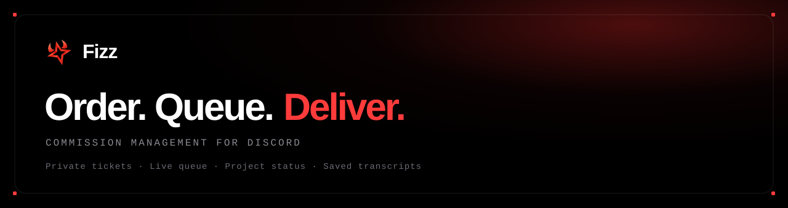

<div align="center">



<br />

**Gerenciamento de comissões para Discord.**
Receba pedidos, organize sua fila e mantenha cada projeto documentado, tudo em um só lugar.

<br />

[](https://discord.com/oauth2/authorize?client_id=1525731670886580365&permissions=268561424&scope=bot+applications.commands)
[](https://usefizz.app)


</div>

<br />

## O que é o Fizz

O Fizz transforma um servidor do Discord numa esteira de comissões para **artistas, designers e freelancers** que recebem pedidos pelo Discord.

No lugar de pedidos perdidos em DMs, uma fila bagunçada de quem é o próximo, e histórico que some quando um canal é deletado, o Fizz mantém o processo inteiro em ordem: do momento em que o cliente abre um ticket até o projeto virar um transcript arquivado.

> **Sem DMs perdidas · Sem listas de pedido bagunçadas · Sem histórico de ticket sumindo**

<br />

## Por que existe

Trabalhar com comissões no Discord normalmente é lidar com três problemas ao mesmo tempo:

- Pedidos espalhados em mensagens privadas
- Uma fila que só existe na sua cabeça
- Histórico de conversa que desaparece assim que um canal é fechado

O Fizz resolve os três. Pedidos de ticket e clientes de DM ficam numa **única fila**, os status mudam conforme você trabalha, e cada conversa é salva como um transcript que sobrevive à deleção do canal.

<br />

## Recursos principais

| | Recurso | O que faz |
|---|---|---|
| 🎫 | **Receber pedidos** | Clientes abrem um ticket privado num clique. Cada pedido fica no próprio canal, longe do chat público. |
| 📊 | **Gerenciar sua carga** | Pedidos de ticket e clientes de DM numa fila só, com posições, status, entradas manuais e Rush Priority opcional. |
| 🔄 | **Acompanhar o status** | Mova os pedidos de esperando, para em progresso, para concluído. Sua carga fica clara em cada etapa. |
| 🗂️ | **Guardar cada registro** | Mensagens, imagens e detalhes salvos em transcripts legíveis que continuam disponíveis depois que o ticket fecha. |

**Também incluído:** notas privadas · blacklist · adicionar e remover usuários · status automático · slash commands.

<br />

## Do pedido à entrega

```
1 · Abrir       O cliente abre um ticket de pedido privado
2 · Fila        O projeto entra na sua fila automaticamente
3 · Prioridade  O Rush Priority opcional pode mover pedidos urgentes pra frente
4 · Progresso   Atualize o status e guarde notas privadas enquanto trabalha
5 · Entrega     Os arquivos finais chegam dentro do ticket
6 · Arquivo     Feche o ticket e o transcript completo é mantido
```

<br />

## Comandos

| Comando | Descrição |
|---|---|
| `/panel` | Posta o painel de pedidos num canal |
| `/queue` | Veja e gerencie sua carga de trabalho |
| `/add-queue` | Adiciona um pedido recebido por DM |
| `/status` | Atualiza o status e a prioridade de um pedido |
| `/done` | Marca um pedido como concluído |
| `/note` · `/notes` | Adiciona e vê notas privadas |
| `/add-user` · `/remove-user` | Gerencia quem enxerga um ticket |
| `/blacklist` · `/unblacklist` | Bloqueia ou desbloqueia um usuário |
| `/close` | Fecha o ticket e salva o transcript |
| `/cmds` | Mostra todos os comandos dentro do Discord |

<br />

## Como funciona

O Fizz é um bot **self-hosted** em **discord.js**, com **Prisma + SQLite**. Cada mensagem de um ticket é gravada no banco no instante em que é enviada, então o transcript não depende do canal do Discord continuar vivo. Os anexos são re-hospedados para os links continuarem funcionando depois que os links do CDN do Discord expiram.

Um **dashboard web** (Next.js) está em desenvolvimento, dando acesso a todos os tickets, transcripts, controle da fila e estatísticas direto no navegador.

```
Discord  ─┐
          ├─►  Bot Fizz (discord.js)  ─►  SQLite (Prisma)  ─►  Dashboard (Next.js)
Clientes ─┘                                   │
                                              └─►  Transcripts + imagens re-hospedadas
```

<br />

## Este repositório

Este repo hospeda a **landing page do Fizz**, um site estático (HTML, CSS e JavaScript puro, sem build) publicado no Cloudflare Pages.

```
index.html      styles.css      assets/
js/  smooth-scroll · intro · canvas · story · app
```

Rodar localmente com qualquer servidor estático:

```bash
npx http-server -p 4173
```

<br />

## Adicionar o Fizz

<div align="center">

[](https://discord.com/oauth2/authorize?client_id=1525731670886580365&permissions=268561424&scope=bot+applications.commands)

</div>

<br />

## Links

- **Site** · [usefizz.app](https://usefizz.app)
- **Portfólio** · [gfxs0da.com](https://gfxs0da.com)
- **Discord** · [discord.gg/s0da](https://discord.gg/s0da)

<br />

<div align="center">

Um projeto de **[@gfxs0da](https://gfxs0da.com)**

</div>
